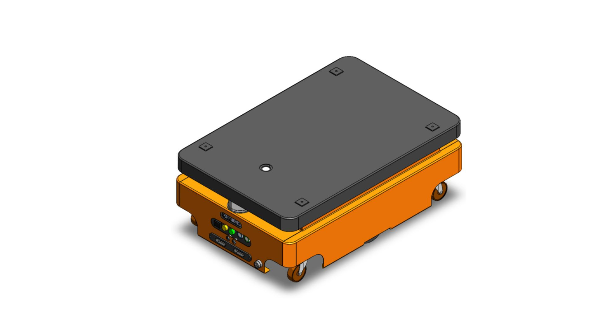
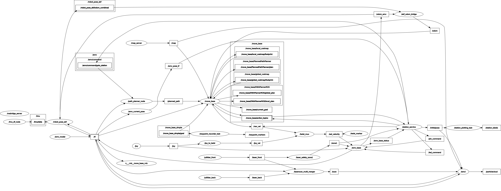

# Autonomous Mobile Robot (AMV2) — System Documentation

เอกสารคู่มือสถาปัตยกรรมระบบ การเชื่อมต่อ ROS Computation Graph, ระบบนำทางไฮบริด (Planned Path + DWA Local Planner), สถาปัตยกรรม Background Service (`amv-start.service`) ตลอดจนคู่มือขั้นตอนการบันทึกสถานีและแนวเส้นทางเดินรถ (Teaching & Recording Workflow)[cite: 1, 3]

---
## Robot URDF AMV2

```bash

<geometry>
  <box size="0.770 0.510 0.160"/>
</geometry>

```
<p align="center">
  
</p>

ความยาว (แกน X): 0.770 เมตร (77 เซนติเมตร)
ความกว้าง (แกน Y): 0.510 เมตร หรือ 51 เซนติเมตร
ความสูง (แกน Z): 0.160 เมตร (16 เซนติเมตร)

---

## Ydlidar_front (YDLidar TG50)
```bash
<origin xyz="0.345 0 0.150" rpy="0 0 -0.5236"/>
```

ตำแหน่ง (xyz): y = 0 แสดงว่าติดตั้งอยู่ กึ่งกลางความกว้างของตัวหุ่นพอดีเป๊ะ (ยื่นไปข้างหน้าจากจุดกึ่งกลาง 34.5 ซม.)

มุมเอียง (rpy): ค่า Yaw -0.5236 rad แปลงเป็นองศาได้ -30 องศาพอดี (เอียงเฉียงไปทางขวา)


---

# git cmd
git push project
```bash
# 1. ดึงข้อมูลโค้ดล่าสุดจากเซิร์ฟเวอร์เพื่อให้ข้อมูล branch อัปเดต
git fetch origin
# 2. สลับไปยัง branch 'test_office' ที่ต้องการอัปเดตงาน (หากยังไม่เคย checkout ลงมาในเครื่อง ให้ใช้คำสั่งนี้)
git checkout test_office 
# 3.git add ได้เลย ทีละไฟล์
git add amv_connect/urdf/amv2.jpg
git add amv_service/station/station_list_office.csv
git add README.md
# 4.git add all
git add .
# 5 ตรวจสอบ สถานะการ add
git status
# 6 git commit ตั้งชื่อว่าทำอะไรไปบ้าง  
git commit -m "Add amv2.jpg, update station list and README for office branch"
# 7 Push งานขึ้นไปยัง branch office
git push origin office
```

git update 

```bash
# 1. อัปเดตฐานข้อมูล Git ในเครื่องให้รับรู้โค้ดล่าสุดบนเซิร์ฟเวอร์
git fetch origin

# 2. ใช้คำสั่งดึงเฉพาะไฟล์ README.md จาก test_office มาทับใน branch ปัจจุบันของคุณ
git checkout origin/test_office -- README.md
```


git merge & pull

```bash
# 1. สลับกลับไปที่ Branch หลักของโปรเจกต์ (ลองดูว่าเป็น main หรือ master)
git checkout main

# 2. ดึงโค้ดล่าสุดจาก GitHub ลงมาอัปเดตก่อน
git pull origin main

# 3. ดึงโค้ดจาก branch test_office มารวมเข้ากับ branch หลัก
git merge test_office

# 4. Push ผลลัพธ์ที่รวมกันแล้วขึ้น GitHub
git push origin main
```
---

## 1. ผังการทำงานและการไหลของข้อมูล (ROS Computation Graph & Data Flow)

ระบบทำงานบน **ROS 1 Noetic**[cite: 1, 6] รองรับการประมวลผลแบบ Distributed Node ทั้งการควบคุมอัตโนมัติ การคัดกรองสิทธิ์ความปลอดภัย และการเชื่อมต่อ Web HMI[cite: 1, 3]

<p align="center">
  
</p>

> **วิธีอ่านกราฟ:** วงรี = ROS Node (Process), สี่เหลี่ยม = Topic (ช่องทางการส่งข้อมูล), กล่องกลุ่ม `move_base` = Namespace ย่อยของโหนดนำทาง, `/tf` = ทรีการแปลงพิกัดที่ถูก Group รวมเป็นโหนดเดียว[cite: 1]

### เส้นทางการไหลของข้อมูลหลัก (Data Flow Architecture)

```text
[LiDAR หน้า/หลัง] ──/laser_front, /laser_back──> [/laserscan_multi_merger] ──/scan──> [/amcl], [/laser_safety_zone1]
                                                                                              │ /zone1 (Safety Cutoff)
[IMU] ──/imu/data──> [/imu_df_node] ──/imu──> [/robot_pose_ekf]
[/amv_model] ──/tf──> [/robot_pose_ekf] ──/robot_pose_ekf/odom_combined──> [/ekf_odom_bridge] ──/odom──> [/move_base]

[/map_server] ──/map──> [/move_base], [/amcl]          (แผนที่ผังอาคาร/โรงงาน)
[/amcl] ──/amcl_pose + /tf──> [/move_base]             (ตำแหน่งตัวรถสัมบูรณ์)

[/station_service] ──/move_base_simple/goal──> [/move_base]  (เป้าหมายภารกิจจาก Web App / Dispatcher)
[/move_base] ──/nav_vel──> [/twist_mux] ──/set_velocity──> [/amv_base]  (คำสั่งขับเคลื่อนส่งลงบอร์ดมอเตอร์)

[Joystick] ──/joy──> [/joy_to_twist] ──/joy_vel──> [/twist_mux]  (สิทธิ์สูงสุด: คุมมือชนะ Auto เมื่อมีการบังคับ)
```
[cite: 1, 3]

---

## 2. รายการโหนดและแพ็กเกจหลัก (Node & Package Registry)

| โหนด (Node) | แพ็กเกจ (Package) | บทบาทและหน้าที่หลัก |
|---|---|---|
| `/ydlidar_front`, `/ydlidar_back` | `ydlidar_ros` | ไดรเวอร์ LiDAR หน้า (TG50, Baudrate 512000) และ LiDAR หลัง[cite: 1, 3, 5] |
| `/laserscan_multi_merger` | `ira_laser_tools` | รวมสัญญาณสแกนเนอร์หน้า-หลังเข้าเป็น Topic `/scan` เส้นเดียว 360 องศา (10 Hz) ที่เฟรม `laser_link`[cite: 1, 3] |
| `/laser_safety_zone1` | `amv_connect` | กันชนเสมือน (Virtual Safety Bumper) เฝ้าระวังสิ่งกีดขวางระยะวิกฤต ส่งสัญญาณตัดหยุดฉุกเฉินผ่าน `/zone1`[cite: 1, 3] |
| `/imu_df_node` | `amv_connect` | กรองและประมวลผลข้อมูลการเอียง/การหมุนจากเซ็นเซอร์ IMU[cite: 1, 3] |
| `/robot_pose_ekf` | `robot_pose_ekf` | Extended Kalman Filter ผสานข้อมูล `/odom_amv` + `/imu/data` บรอดแคสต์ TF `odom` → `base_footprint`[cite: 1, 3] |
| `/ekf_odom_bridge` | `amv_connect` | แปลง `/robot_pose_ekf/odom_combined` ให้อยู่ในฟอร์แมต `nav_msgs/Odometry` (`/odom`) ป้อนให้ `move_base`[cite: 1] |
| `/map_server` | `map_server` | โหลดแผนที่ 2D Occupancy Grid (`office_test_v3` / `.yaml`)[cite: 1, 3] |
| `/amcl` | `amcl` | Monte Carlo Localization เทียบสแกน `/scan` กับ `/map` เพื่อระบุตำแหน่งบนพิกัดแผนที่[cite: 1, 3] |
| `/move_base` | `move_base` | ระบบนำทางหลัก ผสาน `PlannedPathPlanner` (Global) และ `DWAPlannerROS` (Local) พร้อม Costmap 2 ชั้น[cite: 3] |
| `/amv_base` | `amv_connect` | สื่อสารบอร์ดควบคุมขับมอเตอร์ (`/dev/amv_controller`, 57600 baud) และ Publish ข้อมูลล้อ `/odom_amv`[cite: 1, 3] |
| `/amv_current_pose`, `/amv_model`, `/amv_pose_tf` | `amv_connect` | แปลงพิกัดสำหรับ UI, โหลด URDF และบรอดแคสต์ TF โครงสร้างตัวรถ[cite: 1, 3] |
| `/twist_mux`, `/twist_marker`, `/joy_to_twist` | `twist_mux` | จัดลำดับสิทธิ์คำสั่งความเร็ว (Manual Joy > Tab Vel > Auto Nav) และสร้าง Marker ทิศทางความเร็ว[cite: 1, 3] |
| `/station_service` | `amv_service` | จัดการสถานี ภารกิจ Waypoint และสั่งการฮาร์ดแวร์ (`/pin_command`, `/led_command`)[cite: 1, 3] |
| `/station_plotting` | `amv_service` | เรนเดอร์จุดมาร์กเกอร์สถานีและแนวเส้นทางบน RViz[cite: 1] |
| `/rosbridge_server` | `rosbridge_server` | ให้บริการ WebSocket (พอร์ต 9090) สำหรับเชื่อมต่อสื่อสารกับ Web HMI / แท็บเล็ต[cite: 1, 3] |

---

## 3. โครงสร้างระบบวางแผนเส้นทาง (Navigation & Planner Pipeline)

AMV2 ใช้สถาปัตยกรรมวางแผนเส้นทางแบบ **4 ระดับ (Multi-Layer Pipeline)** เพื่อบังคับให้รถเกาะแนวโครงข่ายเสมือน (Topological Virtual Track) ตามมาตรฐานความปลอดภัยในพื้นที่ปิด[cite: 3, 5]:

```text
[ Topological Graph ใน CSV ]
             │
             ▼
[ ชั้นที่ 1: External Planner ]
path_planner_node.py ──> /planned_path (แนวทางเดินทั้งภารกิจจากฐานข้อมูล CSV)
                               │
                               ▼
[ ชั้นที่ 2: Global Planner ]
PlannedPathPlanner ──> /move_base/PlannedPathPlanner/plan (ตัดเฉพาะช่วง: รถปัจจุบัน ──> Goal)
                               │ (หากหลุดเกิน 1.0 m จะสลับไปใช้ navfn_fallback อัตโนมัติ)
                               ▼
[ ชั้นที่ 3: Local Planner Reference ]
DWAPlannerROS ──> /move_base/DWAPlannerROS/global_plan (จำกัดช่วงพิกัดใน Local Costmap 3 m ข้างหน้ารถ)
                               │
                               ▼
[ ชั้นที่ 4: Trajectory Generation ]
DWAPlannerROS ──> /move_base/DWAPlannerROS/local_plan (จำลองวิถีขับเคลื่อนจริง ──> ส่ง /nav_vel)
```
[cite: 3]

* **ชั้นที่ 1 (ภายนอก):** `path_planner_node.py` ปล่อย `/planned_path` (เส้นสีเขียวโครงข่ายตาม Topological Graph ใน CSV คำนวณด้วย Dijkstra)[cite: 1, 2, 3]
* **ชั้นที่ 2 (Global Planner):** `amv_navigation/PlannedPathPlanner` ดึง `/planned_path` มาตัดเป็น `/move_base/PlannedPathPlanner/plan` (เส้นทางจากจุดที่รถอยู่ปัจจุบัน $\rightarrow$ ปลายทาง)[cite: 3]
* **ชั้นที่ 3 (Local Planner Reference):** `DWAPlannerROS` ดึงไปครอบด้วย Local Costmap กลายเป็น `/move_base/DWAPlannerROS/global_plan` (ช่วงระยะอ้างอิง 3 เมตรข้างหน้ารถ)[cite: 3]
* **ชั้นที่ 4 (Trajectory Generation):** `DWAPlannerROS` สุ่มจำลองวิถีการเลี้ยวและการขับเคลื่อนจริงออกมาเป็น `/move_base/DWAPlannerROS/local_plan` (เส้นสีแดงใน RViz) แล้วแปลงเป็นคำสั่งความเร็วส่งออกทาง `/nav_vel`[cite: 3]
* **ทางเลือกสำรอง (Safety Fallback):** หากรถหลุดแนวรางเกิน $1.0\text{ m}$ (`planned_path_max_match_dist`) หรือยังไม่มี `/planned_path` ระบบจะตัดการทำงานไปใช้ `navfn_fallback` (`/move_base/navfn_fallback/plan`) นำทางแบบอิสระแทนทันที[cite: 3]

### ตารางเปรียบเทียบ Topic เส้นทางหลัก

| มิติการเปรียบเทียบ | `/planned_path` | `/move_base/PlannedPathPlanner/plan` |
|---|---|---|
| **โหนดต้นทาง** | `path_planner_node.py`[cite: 3] | โหนด `move_base` (ปลั๊กอิน `PlannedPathPlanner`)[cite: 3] |
| **ขอบเขตเส้นทาง** | แนวทางเดินทั้งหมดของภารกิจ (เช่น Material Room $\rightarrow$ wy1 $\rightarrow$ wy2 $\rightarrow$ Line1)[cite: 3] | ตัดเฉพาะช่วงจาก "ตำแหน่งที่รถอยู่ปัจจุบัน" มุ่งหน้าไปหา Goal[cite: 3] |
| **ความสัมพันธ์กับ Costmap** | ไม่สนใจ Costmap (คำนวณตาม Topological Graph ใน CSV)[cite: 3] | เชื่อมโยงกับ `global_costmap` เพื่อตรวจสอบสิ่งกีดขวางและสั่ง Fallback[cite: 3] |
| **ปลายทางผู้ใช้งาน** | แสดงผลบน RViz และส่งให้ปลั๊กอิน Planner ดึงไปอ้างอิง[cite: 3] | ส่งตรงเข้า Local Planner (`DWAPlannerROS`) เพื่อคำนวณความเร็วขับล้อ[cite: 3] |
| **สถานะเมื่อรถหลุดนอกแนว** | คงตำแหน่งเส้นเดิมไว้ ไม่เปลี่ยนรูปร่าง[cite: 3] | หากรถอยู่ห่างเกิน $1.0\text{ m}$ จะสลับรูปร่างกลายเป็นเส้นทางของ Navfn อัตโนมัติ[cite: 3] |

---

## 4. การจัดการ Service เบื้องหลัง (`amv-start.service`)

ระบบอัตโนมัติของตัวรถทำงานผ่าน Systemd ภายใต้ชื่อบริการ `amv-start.service`[cite: 1, 8]:

```bash
# หยุดการทำงานของ Service ระบบหลัก
sudo systemctl stop amv-start.service

# เริ่มต้นการทำงาน Service ใหม่
sudo systemctl restart amv-start.service

# ตรวจสอบสถานะการทำงานของระบบ
sudo systemctl status amv-start.service
```
[cite: 1, 3, 8]

---

## 5. ขั้นตอนการบันทึกสถานีและเส้นทาง (Step 2: Teaching & Recording Workflow)

เมื่อจัดทำแผนที่ (Mapping) เสร็จสิ้น ให้ดำเนินตามขั้นตอน Step 2 ด้านล่างเพื่อทำการบันทึกพิกัดสถานีและ Waypoint[cite: 1, 3]:

### 1. ปิด Service พื้นหลังของหุ่นยนต์
หยุด Service ปกติเพื่อปลดล็อกพอร์ต Serial Hardware (`/dev/amv_controller`, `/dev/ydlidar_*`)[cite: 3]:
```bash
sudo systemctl stop amv-start.service
```
[cite: 1, 3, 8]

### 2. รันโหมดการบันทึกข้อมูล (Recording Mode)
เปิดระบบเซ็นเซอร์และการระบุตำแหน่งสำหรับงานบันทึกพิกัด:
```bash
roslaunch amv_navigation amv_recording.launch
```

### 3. บันทึกสถานีและ Waypoint (แยกเปิดใน Terminal ใหม่)

* **บันทึกสถานี (Station Recording):**
  ```bash
  rosrun amv_service station_plotting_test.py
  ```
  * ใช้เครื่องมือ **2D Pose Estimate** บน RViz ในการคลิกกำหนดตำแหน่งและทิศทางของสถานี[cite: 1]

* **บันทึกแนวทางเดิน Waypoint (Waypoint Recording):**
  ```bash
  rosrun amv_service waypoint_recorder_test.py
  ```
  * ใช้เครื่องมือ **2D Nav Goal** บน RViz ลากคลิกตามแนวทางเดินเพื่อบันทึกจุดทางผ่านย่อย[cite: 1]

---

### บริการจัดการข้อมูลการบันทึก (Recorder Services)

#### บริการจัดการสถานี (Station Recorder Commands)
```bash
# ลบสถานีล่าสุด + เขียน CSV + วาด marker ใหม่
rosservice call /amv/recorder/undo_station "{}"

# ล้างสถานีทั้งหมด
rosservice call /amv/recorder/clear_station "{}"

# บันทึกสถานีลงไฟล์ CSV
rosservice call /amv/recorder/save_station "{}"
```

#### บริการจัดการ Waypoint (Waypoint Recorder Commands)
```bash
# ลบ waypoint ล่าสุด + save CSV + วาด marker ใหม่
rosservice call /amv/recorder/undo_waypoint "{}"

# ล้างรายการ waypoint ทั้งหมด
rosservice call /amv/recorder/clear_waypoint "{}"

# บันทึก waypoint ลง CSV (ระบบ Auto-save เป็นค่าเริ่มต้น)
rosservice call /amv/recorder/save_waypoint "{}"
```

---

## 6. การทดสอบและสั่งงานระบบ (Testing & Verification)

### ทดสอบการสร้างแนวเส้นทาง (Path Planner Trigger)
ทดสอบสั่งให้ `path_planner_node.py` คำนวณเส้นทางและ Publish ออกทาง `/planned_path`:
```bash
rostopic pub -1 /amv/command/goto_station std_msgs/String "data: 'Line1'"
```
[cite: 2, 3]

### ทดสอบสั่งหุ่นยนต์เคลื่อนที่ไปยังสถานี (Service Call)
สั่งให้หุ่นยนต์เริ่มเคลื่อนที่ปฏิบัติภารกิจเดินทางไปยังสถานีเป้าหมาย:
```bash
rosservice call /go_station "target_station: 'Line1'"
```
[cite: 3]

### คำสั่งตรวจสอบสถานะและสัญญาณ (Diagnostics)
```bash
# ตรวจสอบความถี่ของข้อมูล Odometry และ Laser สแกนรวม
rostopic hz /odom /scan

# ตรวจสอบตำแหน่งพิกัดปัจจุบันจาก AMCL
rostopic echo /amcl_pose -n 1

# ตรวจสอบคำสั่งความเร็วขับเคลื่อนมอเตอร์
rostopic echo /nav_vel
```
[cite: 1, 3, 4, 8]
