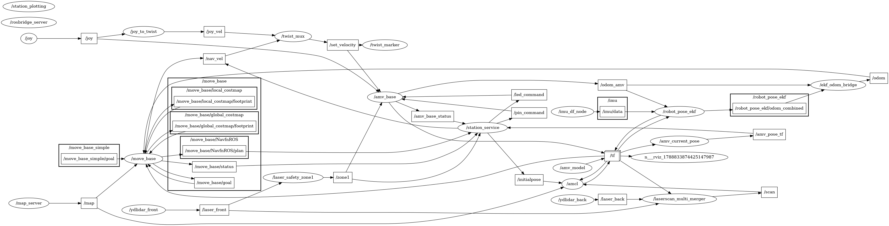

Autonomous Mobile Robot (AMV2).
---

## ROS Computation Graph
ผังการเชื่อมต่อโหนดและ Topics ทั้งหมดของระบบ AMV2 ขณะทำงานผ่าน `amv-start.service` (ดึงจาก rqt_graph แบบสด):

<p align="center">
  
</p>

**วิธีอ่านกราฟ:** วงรี = ROS Node (โปรเซส), สี่เหลี่ยม = Topic (ช่องส่งข้อมูล), กล่องกลุ่ม `move_base` = namespace ย่อยของโหนด, `/tf` = topic การแปลงพิกัดที่ถูก Group รวมเป็นโหนดเดียว

---

### 1. Data Flow (เส้นทางข้อมูลหลัก)

```
[LiDAR หน้า/หลัง] ──/laser_front, /laser_back──> [/laserscan_multi_merger] ──/scan──> [/amcl], [/laser_safety_zone1]
                                                                                              │ /zone1 (สั่งหยุดฉุกเฉิน)
[IMU] ──/imu/data──> [/imu_df_node] ──/imu──> [/robot_pose_ekf]
[/amv_model] ──/tf──> [/robot_pose_ekf] ──/robot_pose_ekf/odom_combined──> [/ekf_odom_bridge] ──/odom──> [/move_base]

[/map_server] ──/map──> [/move_base], [/amcl]          (แผนที่โลจิสติก)
[/amcl] ──/amcl_pose + /tf──> [/move_base]             (ตำแหน่งหุ่นที่ estimate ได้)

[/station_service] ──/move_base_simple/goal──> [/move_base]  (รับเป้าหมายจาก Web App / สถานี)
[/move_base] ──/nav_vel──> [/twist_mux] ──/set_velocity──> [/amv_base]  (คำสั่งเคลื่อนที่ลงบอร์ด)

[Joystick] ──/joy──> [/joy_to_twist] ──/joy_vel──> [/twist_mux]  (ควบคุมด้วยมือ ชนะ Auto เมื่อบังคับ)
```

### 2. โหนดหลักและบทบาท

| โหนด | แพ็กเกจ | บทบาท |
|---|---|---|
| `/ydlidar_front`, `/ydlidar_back` | `ydlidar_ros` | ไดรเวอร์ LiDAR หน้า/หลัง |
| `/laserscan_multi_merger` | `ira_laser_tools` | รวมสแกนหน้า+หลังเป็น `/scan` เดียว |
| `/laser_safety_zone1` | `amv_connect` | กันชนเสมือน (Safety Zone) — สั่งหยุด/ลดความเร็วผ่าน `/zone1` |
| `/imu_df_node` | `amv_connect` | กรอง/ประมวลผล IMU (Dead Reckoning) |
| `/robot_pose_ekf` | `robot_pose_ekf` | ฟิวชัน Odometry + IMU เป็น `/tf` ของหุ่น |
| `/ekf_odom_bridge` | `amv_connect` | ปรับรูป `/robot_pose_ekf/odom_combined` → `/odom` ให้ move_base |
| `/map_server` | `map_server` | โหลดแผนที่ `office_test_v1` |
| `/amcl` | `amcl` | Monte Carlo Localization — ประมาณตำแหน่งบนแผนที่ |
| `/move_base` | `move_base` | Global (Navfn) + Local (DWA) Planner, costmap 2 ชั้น |
| `/amv_base` | `amv_connect` | สื่อสารบอร์ดควบคุม (`/dev/amv_controller`), publish `/odom_amv` |
| `/amv_current_pose`, `/amv_model`, `/amv_pose_tf` | `amv_connect` | ประมวลผล/แปลงตำแหน่งสำหรับ UI และ TF |
| `/twist_mux`, `/twist_marker`, `/joy_to_twist` | `twist_mux` | ตัวสลับคำสั่งความเร็ว (Auto / Joy) + แสดงภาพ cmd_vel |
| `/station_service` | `amv_service` | จัดการสถานี ภารกิจ Waypoint (`/pin_command`, `/led_command`) |
| `/station_plotting` | `amv_service` | จุด plot เส้นทาง/ภารกิจบนแผนที่ |
| `/rosbridge_server` | `rosbridge_server` | WebSocket ให้ Web App ควบคุมผ่าน `/amv_pose_str` ฯลฯ |
| `/rviz_*` | `rviz` | Viewer (ไม่กระทบการทำงาน) |

### 3. Core Packages
* `amv_connect`: บอร์ดสื่อสารฮาร์ดแวร์, WebSocket bridge และสถานะไฟ/เสียง
* `amv_navigation`: ระบบนำทางหลัก (Costmap, AMCL, Global/Local Planner)
* `amv_service`: จัดการสถานี ภารกิจ และ Waypoint Control
* `amv_virtual_track`: ระบบรางนำทางเสมือน (Virtual Track Controller) — **ยังไม่เปิดใช้งานใน service**
* `ydlidar_ros-master` & `ira_laser_tools`: ไดรเวอร์และการรวมสัญญาณ LiDAR หน้า-หลัง

> **หมายเหตุ:** กราฟนี้เป็นสถานะที่รันจริงผ่าน `amv-start.service` (เปิดเฉพาะ `amv_navigation.launch`); `amv_qr_detection` ถูกคอมเมนต์ไว้ใน launch และ `amv_mapping` ใช้เฉพาะตอนทำแผนที่เท่านั้น
